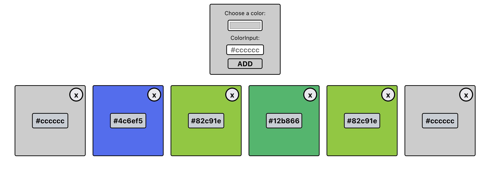

# Color Saver App

- [x] Prepare App for devlopment
- [x] Adding initial color objects in a array
- [x] Adding color Cards
- [x] Adding Color Add Form to the Header
- [ ] Refactor form elements
- [ ] Edit color of cards
- [ ] Adding validation to the input field
- [ ] Add feedback to coping the colorhex to the clipboard
- [ ] Add color API to get color names
- [ ] Add color pallet
- [ ] Edit color pallet header

State of the App at launch.
You can add more colors to list below by either picking a color in the color wheel or write the color hexcode (e.g. #cccccc)

For now the text input only accepts 6-digit hexcode with `#` at the beginning.

If you select a color with the color wheel it will fill out the text input for you.

The text input is required.

Besides that there is no validation yet.
You can still write empty strings, but it will leave the the color empty, creating a blank card.
You can delete the blank card with the delete button.

Clicking the cards will copy the color hexcode to the clipboard.
No feedback added yet, besides a console.log.
